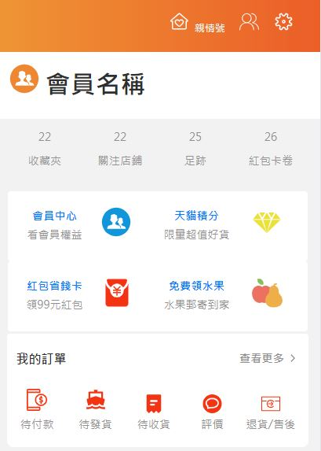
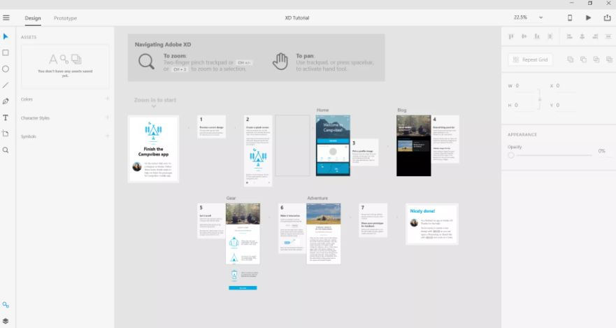
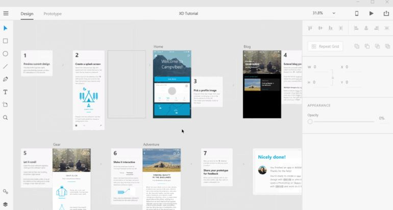
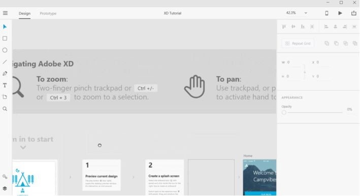
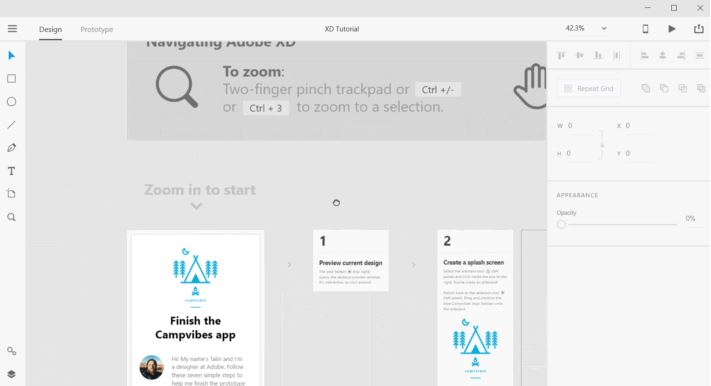
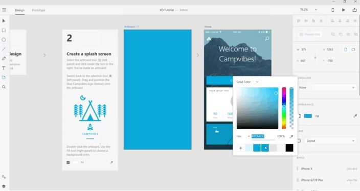

# work-report

109.07.17 週五報告
## 1.依照淘寶版型切板，製作設定，通訊錄，親情號1
## 2.照淘寶版型切板，製作收藏夾，關注店鋪，足跡，紅包卡卷1
## 3.熟悉Adobe XD功能
### Adobe XD功能
（1）點選左下角的Begin Tutorial按鈕即可開啟教學檔案，進入下面這個畫面。

（2）視角縮放，點選鍵盤上的 Ctrl 或 Alt 加上 +/- 或 滑鼠滾輪。

（3）移動視角，點選鍵盤上的 空白鍵 加上 滑鼠左鍵。視角縮放，點選鍵盤上的 Ctrl 或 Alt 加上 +/- 或 滑鼠滾輪。

（4）預覽APP，點選右上角的播放按鈕，來預覽目前的範例專案。

（5）新增畫板，點選新增畫板Artboard按鈕，可透過右側欄新增制式畫板，或自己拉大小。
接著將游標狀態選回點選工具，並點選剛才新增畫板的標題，即可針對此畫板進行編輯。
如：透過右方的色彩Fill欄位可變更畫布的背景色。

## 4.九東方
(1)九東方形象網頁定板

(2)調查分析中国網站的市場，網站功能

